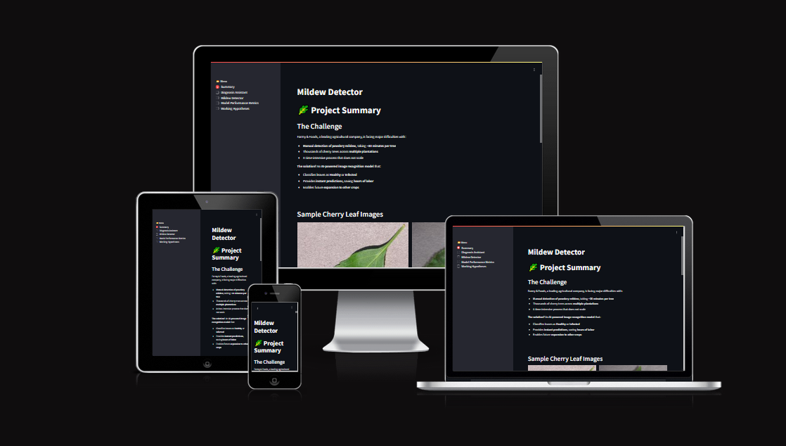

# [Mildew Detector](https://detect-mildew-1e5e3ef17076.herokuapp.com/)
(Developer: Damian Droste)

[](https://www.github.com/n4v1ds0n/PP5-predictive_analysis/commits/main)
[](https://www.github.com/n4v1ds0n/PP5-predictive_analysis/commits/main)
[](https://www.github.com/n4v1ds0n/PP5-predictive_analysis)


[Page on AmIResponsive](https://ui.dev/amiresponsive?url=https://detect-mildew-1e5e3ef17076.herokuapp.com/)

...for your daily transactions, cashflow clarity, and categorical control.

Budget Ledger is a **terminal-based personal finance tracker** built in Python 3, 
designed to help users manage their income and expenses through an intuitive CLI 
interface.

[Link to live dashboard deployment (Heroku)](https://detect-mildew-1e5e3ef17076.herokuapp.com/)

---

## Table of Contents
1. [Dataset Description](#dataset-description)
2. [Business Requirements](#business-requirements)
3. [Hypothesis and validation](#hypotheses-and-validation)
4. [Model Architecture](#model-architecture)
5. [Implementation of the Business Requirements](#the-rationale-to-map-the-business-requirements-to-the-data-visualizations-and-ml-tasks)
6. [ML Business case](#ml-business-case)
7. [Dashboard design](#dashboard-design-streamlit-app-user-interface)
8. [CRISP DM](#crisp-dm-approach)
9. [Testing](#testing)
10. [Bugs](#bugs)
11. [Deployment](#deployment)
12. [Technologies used](#technologies-used)
13. [Credits](#credits)

## Dataset Description

This dataset contains 4,208 high-quality images of individual cherry leaves, each classified as either healthy or infected with [powdery mildew](https://en.wikipedia.org/wiki/Powdery_mildew) — a widespread fungal disease affecting many plant species, including bitter cherry trees (Prunus spp.), the client's primary crop.

All images were captured under consistent, uniform conditions: the leaves are centered against a grey, grainy background, which provides strong visual contrast and supports reliable image analysis.
The dataset was sourced from [Kaggle](https://www.kaggle.com/datasets/codeinstitute/cherry-leaves).

## Business Requirements

Farmy & Foods, a company in the agricultural sector, requested the development of a machine learning system capable of detecting powdery mildew — a fungal disease affecting cherry trees — from images of individual leaves.

The company currently relies on a manual inspection process: an employee examines several leaves per tree and applies treatment if mildew is found. This method is time-consuming (30 minutes per tree) and not scalable, given their thousands of cherry trees spread across multiple farms nationwide.

The client aims to automate this process using an AI-powered visual inspection system that can instantly identify whether a leaf is healthy or infected, thereby significantly reducing labor time and enabling early intervention to protect crop quality.

Summary of Business Requirements:

- Visually differentiate healthy cherry leaves from those infected with powdery mildew.

- Automatically predict the health status of a leaf based on an image.

- Provide interpretable prediction reports for the examined leaves.


## Hypotheses and Validation

Hypothesis 1: Visual signs of mildew infection are detectable

Hypothesis 2: A softmax output neuron is the better choice despite of binary dataset

Hypothesis 3: A CNN can reliably detect powdery mildew

Hypothesis 4: The model might have difficulties to Generalize Beyond the Training Domain

### Hypothesis 1: Visual signs of infection are detectable

Statement: Powdery mildew creates distinct visual patterns—such as white, powdery spots—that can be reliably captured in leaf imagery.

Rationale: Since the disease alters the leaf's surface texture and coloration, it should be visually distinguishable from healthy leaves, particularly in a controlled imaging environment.

Validation:

- Manual inspection of the dataset confirmed consistent and distinct mildew markings.

- Create averaged images for each class and a standard deviation image -> differences detectable

- Exploratory Data Analysis (EDA) showed clustering of image features in principal component space, suggesting separability.
  - PCA, t-SNE and UMAP showed increasingly distinguishable clusters, which suggests good class seperability.


### Hypothesis 2: A softmax output neuron is the better choice despite of binary dataset

Statement: Although for a binary classification problem the single output neuron setup with a sigmoid function returning 1 or 0 is the default approach. However there are indications, that especially for gradient based optimization a categorical approach with two softmax Neurons might be better. This is because categorical loss can sometimes offer better learning curves due to gradient stability.

Rationale: A sigmoid function outputs a probability between 0 and 1, making it ideal for binary outcomes. But softmax, which is usually better suited for multi-class problems, might lead to more accurate results due to better gradient stability.

Validation:

    Comparison of sigmoid vs. softmax output layers by running a ffold for each setup to compare accuracy and time consumption

    The models produced well-calibrated probability scores.

Conclusion:
The kfold duel showed that the softmax approach is not only reaching a higher accuracy, but also training faster on average, making it the objectively better choice for our model.
    


### Hypothesis 3: A CNN can reliably detect powdery mildew

Statement: A Convolutional Neural Network (CNN) can learn the relevant spatial patterns in the leaf images to distinguish between healthy and infected samples with high accuracy.

Rationale: CNNs are well-suited for image classification tasks as they extract hierarchical visual features such as edges, textures, and shapes.

Validation:

- The model achieved strong performance metrics (e.g., accuracy, precision, recall) on the validation and test sets.

- Learning curves showed convergence without significant overfitting.

- Confusion matrices, classification report, ROC curce and AUC score showed excelling results the AUC score was 1 which is a perfect score

Conclusion:
The model can make very reliable predictions on the test data and distinguish between healthy and mildew-infected leaves.


### Hypothesis 4: The model might have difficulties to Generalize Beyond the Training Domain

Statement: A model trained on clean, uniformly staged leaf images might have problems to effectively extraploate to to real-world conditions where leaves appear in varied lighting, angles, and backgrounds. If the leaves are not photographed under the same conditions the model might be misclassifying.

Rationale: For the model to be practically useful in the field, it should handle natural variability — including non-isolated leaves, overlapping foliage, crumpling, varying lighting conditions, or inconsistent focus — none of which are present in the curated training dataset. Otherwise the model will still be useful, but much more difficult to apply.

Validation:

    A set of real-world test images (generated by AI, but realistic) were used to evaluate model robustness.

    Performance on these out-of-distribution (OOD) images was significantly lower, revealing overreliance on artificial features like consistent background, brightness, and contrast.

    Attempts to compensate using Test-Time Augmentation (TTA) and extensive data augmentation yielded only marginal improvements, underscoring the importance of representative training data.

Conclusion:
The model suffers from poor extrapolation due to the highly uniform dataset. For field-ready performance, substantial improvements should be made through:

- Dataset diversification (adding naturally captured leaf images),

- Domain adaptation techniques, or

- Synthetic data generation that mimics field conditions.

## Model Architecture

### Project Goal  
This project aims to detect **powdery mildew infections** in cherry leaves using a custom convolutional neural network (CNN). The dataset consists of uniformly captured, centered cherry leaf images, labeled as either *healthy* or *infected*. Given the clearly distinguishable visual cues and the binary nature of the classification task, a CNN is an ideal choice.

---

### Custom CNN Model Summary

The model was built using Keras' `Sequential` API and follows a simple yet effective structure:

- **Input**: RGB images resized to `128x128x3`
- **Convolutional Blocks**: 3 blocks of increasing filters (`32 → 64 → 128`) using `Conv2D` with ReLU and `MaxPooling2D` to downsample
- **Fully Connected Layer**: A single dense layer with 64 neurons
- **Regularization**: Dropout of 30% after flattening to reduce overfitting
- **Output**: 1 neuron with `sigmoid` activation for binary classification
- **Loss Function**: `binary_crossentropy`
- **Optimizer**: Adam with learning rate `1e-4`

> If the number of classes is changed (e.g., for multiclass disease types), the model automatically switches to a `softmax` output with `categorical_crossentropy`.

```python
# Pseudocode overview
model = build_custom_cnn(
    shape=(128, 128, 3),
    num_classes=1,
    base_filters=32,
    conv_blocks=3,
    dense_units=64,
    dropout_rate=0.3,
    learning_rate=1e-4
)
```

### ⚙️ Why This Architecture


| Component |	Justification |
|---|---|
|Conv2D (3x3 kernels)	| Efficient at capturing local features such as mildew texture and shape.|
|MaxPooling	| Reduces spatial size and computation, helps with feature generalization. |
|ReLU activation |	Speeds up convergence and avoids vanishing gradients. |
|Dropout (0.3)	| Helps regularize the model, important given the relatively small dataset size. |
|Sigmoid output	| Suitable for binary classification — interprets output as infection probability. |
|Adam optimizer	| Adaptive and widely used; balances speed and stability.  |


### Sigmoid vs. Softmax in Context

There is some debate between using sigmoid vs. softmax in binary classification:

Sigmoid + 1 output node:

- Interprets the output as the probability of being in class 1.

- Works well when classes are mutually exclusive.

- Computationally cheaper and more direct.

Softmax + 2 output nodes:

- Produces a full probability distribution.

- Technically overkill for binary classification but may help in multiclass extensions.

- Some argue it performs better in gradient-based optimization.

In this project, we use sigmoid, treating the task as binary classification with binary_crossentropy loss, which is appropriate and efficient.

### Training Configuration

    Epochs: 25 (with early stopping)

    Callbacks:

        EarlyStopping to prevent overfitting

        ModelCheckpoint to save the best model

    Metrics Tracked: Accuracy, validation loss

```python
callbacks = [
    EarlyStopping(patience=5, restore_best_weights=True),
    ModelCheckpoint('path/to/save/mildew_detector.h5', save_best_only=True)
]

history = model.fit(
    train_set,
    validation_data=validation_set,
    epochs=25,
    callbacks=callbacks,
    verbose=1
)
```

## ML Business Case

The Mildew Detector


### Objective

Develop a machine learning model to automatically classify whether a cherry leaf is infected with powdery mildew based on image data provided by the Farmy & Foody company. This is a supervised learning problem, framed as binary image classification.

### Problem Framing

- Type: Supervised Learning

- Task: Binary classification (Healthy vs. Diseased)

- Label Type: Single-label, mutually exclusive

- Input: RGB image of a cherry leaf

- Output:

    - A binary flag indicating infection status

    - A confidence score (probability between 0–1)

### Success Criteria

- Accuracy target: ≥ 87% on the test set

- Inference mode: Real-time / on-demand (no batch inference)

- Deployment target: Mobile/web application for field use by farmers

### Business Rationale

Currently, disease detection relies on manual leaf inspection, where a farmer spends ~30 minutes per tree, sampling and visually inspecting leaves. This process is:

- Time-consuming

- Prone to human error

- Scalable only with increased labor costs

By automating the diagnosis via a mobile app, we can offer:

- Faster diagnosis

- Consistent accuracy

- Reduced labor and inspection costs

- Scalable disease monitoring

### Data Source

- Dataset: Cherry Leaf Disease Dataset on Kaggle

- Provided by: Farmy & Foody

- Image Count: 4,208 cherry leaf images, 2 classes: Healthy and Powdery Mildew Infected, Format: 128x128 RGB JPEG images

## CRISP-DM Approach

This project follows the CRISP-DM (Cross-Industry Standard Process for Data Mining) methodology to ensure a structured and iterative approach to developing a deep learning model for powdery mildew detection in cherry leaves.

### 1. Business Understanding

- Defined the business objective: automate early detection of diseased leaves to reduce manual inspection overhead.

- Success criteria: high classification accuracy, ease of deployment, and actionable output for end users.

### 2. Data Understanding

- Acquired a labeled image dataset from Farmy & Foods.

- Performed exploratory analysis, image inspection, PCA, t-SNE and UMAP to evaluate class separability and identify potential data quality issues.

### 3. Data Preparation

Preprocessing steps included:

- Resizing, normalization, and data augmentation of training set (e.g., flips, zoom) to enhance generalization.

- Dataset split: 70% train, 15% validation, 15% test, maintaining class balance.

### 4. Modeling

- Implemented a Convolutional Neural Network (CNN) optimized for binary classification using Softmax activation and categorical crossentropy.

- adjusted hyperparameters (e.g., learning rate, batch size, optimizer).

- Monitored performance using validation loss, accuracy, and ROC-AUC.

### 5. Evaluation

Evaluated model on the held-out test set using:

- Classification report (precision, recall, F1-score)

- Confusion matrix and ROC curves

- Met performance benchmarks (≥ 90% test accuracy) defined in the business case.

- Tested for data-leakage

- Tested predictions on real world image examples

### 6. Deployment & Monitoring

- Deployed the model in a Streamlit web app for real-time predictions.

- Integrated automated prediction reports with class probabilities.

- Notebooks can be used as a retraining pipeline for continuous improvement if new data is acquired.

### Conclusion

Following the CRISP-DM process enabled a clear, reproducible path from problem definition to deployment. The result is a scalable, interpretable, and production-ready mildew detection tool tailored for use in precision agriculture.

## Testing


## Debugging

### Fixed Bugs

| Bug | Fix |
|---|---|
|**Confusion matrix for model was off compared to performance statistics**|Wrote 'collect predictions functions that stores predictions in a list to avoid errors|
|**Training the CNN with a softmax output returned an error where it could not process the dataset**|Had to set the class mode of the dataset augmentation to categorical instead of binary|
|**Code cell could not find test-image folder**| removed hidden space typed in folder name|

### Unfixed Bugs

None known at time of submission.

---
## Deployment

The project is hosted on GitHub and deployed via Heroku.

### Create an App on Heroku

To deploy this project on Heroku, follow these steps:

- Ensure a requirements.txt file is present in the GitHub repository to specify all Python dependencies.

- Include a runtime.txt file to define the Python version (e.g., python-3.11.8) supported by the Heroku-20 stack.

- Push the latest code changes to GitHub.

- Log in to your Heroku dashboard and create a new app.

- Click Create New App, assign a unique name, and choose a region.

- Under the Settings tab, add the heroku/python buildpack.

- In the Deploy tab:

    - Choose GitHub as the deployment method.

    - Connect to your GitHub account and select the repository for this project.

- Select the branch to deploy, then click Deploy Branch.

- Optionally, enable Automatic Deploys for continuous deployment or use Manual Deploy.

- Monitor the build logs as dependencies are installed and the app is built.

- Once deployed, the app will be available at a URL similar to: https://your-app-name.herokuapp.com/

- If the slug size exceeds the limit, add non-essential files to a .slugignore file to reduce build size. This might include packages you are only using in your notebooks, you can remove them from your requirements file and install them from a notebook cell.

## Forking the Repository

If you want to fork this project repository you are very welcome to do so:

- Go to the GitHub Repository.

- Log into your GitHub account.

- Click the Fork button at the top-right corner.

- Select the destination (e.g., your own GitHub account).

- You now have a personal copy of the repository to modify without affecting the original.

## Cloning the Repository Locally

If you want to work on your fork locally, you can clone the project to your machine:

- Navigate to the GitHub Repository.

- Click the Code button and choose one of the cloning methods (HTTPS, GitHub CLI, ZIP).

- To clone via HTTPS:

    - Copy the URL under Clone with HTTPS

    - Open a terminal or Git Bash

    - Navigate to the desired directory

    - Run:

    git clone https://github.com/*yourhandle*/PP5-predictive_analysis.git

- Press Enter and wait for the process to complete.

- For additional help, refer to the GitHub cloning guide.

---

## Technologies used

### Platforms
- [Heroku](https://en.wikipedia.org/wiki/Heroku) Deployment
- [Jupiter Notebook](https://jupyter.org/) Data acquisition, exploration and training area
- [Kaggle](https://www.kaggle.com/) Data source
- [GitHub](https://github.com/): Repo storage
- [VSCode](https://code.visualstudio.com/) Local IDE


### Languages
- [Python](https://www.python.org/)
- [Markdown](https://en.wikipedia.org/wiki/Markdown)
  
### Main Data Analysis and Machine Learning Libraries
<pre>
numpy==1.26.1
pandas==2.1.1
matplotlib==3.8.0
seaborn==0.13.2
plotly==5.17.0
Pillow==10.0.1
streamlit==1.40.2
joblib==1.4.2
tensorflow-cpu==2.16.1
scikit-learn==...
</pre>

## Credits


### Acknowledgements

Thanks to [Code Institute](https://codeinstitute.net/global/), especially Kay Welfare and my mentor Mo Shami. 

### Deployed version at [Mildew Detector](https://detect-mildew-1e5e3ef17076.herokuapp.com/)